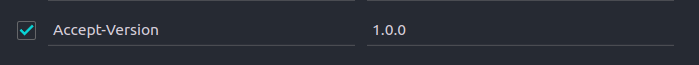
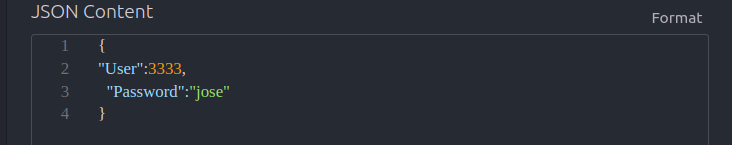
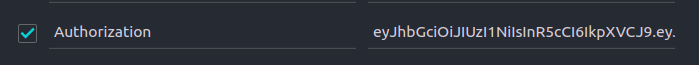

# mongoCitas

## Descripcion

se creo una base de datos con mongoDB sobre el funcionamiento de un agendamiento de citas medicas con sus respectivas consultas. 

## Diagrama Inicial


 


## Requisitos previos

- Node.js instalado en tu máquina.

## Instalación

1. Clona este repositorio o descarga los archivos en tu máquina local.
2. Abre una terminal en el directorio raíz de la aplicación.
3. Ejecuta el siguiente comando para instalar las dependencias:

```
npm install
```


## Configuración

1. Crea una copia del archivo `.env.example` con el nombre `.env` en el directorio raíz de la aplicación.
2. El archivo `.env` , viene con las iguientes varibales definidas:

```javascript
MY_CONFIG={"hostname":"127.17.0.92", "port":5017}
MY_CONNECT= {"user": "cavillafrades", "password":"1005344957", "nameDB": "db_citas_campus"}
MY_JWT="villafrades"
```


De esa manera podremos acceder a la base de datos que hemos creado y sus registros por defectos.

1. Ahora corremos enla terminal el comando **npm run dev**.

2. Revisar que el "hostname" y el "port" no se encuentren en uso, en caso de generar algun error cambiar esos datos en el archivo `.env`.

   #### Ubicacion db

   - La creacion de nuestra base de datos e insercion de registros se ecuentran en la ruta **db/query.mongodb**

##  Importante antes de empezar

- Se creo un versionado para los Endpoints el cual por el momento solo tenemos la version **1.0.0**, es importante hacerle el llamado parea poder logearnos y manipular los enpoints.

- Debemosos generar un logeo con algunos de los usuarios presentados a continuacion para poder generar un **token** de acceso y dependiendo de los **permisos**, poder acceder a los Endpoints. Este token debemos colocarlo en nuestro **header/Autorization**, nuestro token tendra un limite de duracion de **3H**, en ese rango de tiempo podremos acceder a las consultas permitidas por el rol.

    #### Usuarios

    ```javascript
    users:{
        admins:[
            {
         	"User":3333,
      		"Password":"jose"
            }
               ],
         empleados:[
             {
             "User":2222,
      		"Password":"maria"
             },
             {
             "User":4444,
      		"Password":"luis"
             },
             {
             "User":5548,
      		"Password":"felipe"
             }
         ]
    }
    ```

    

    #### permisos

    - admin ["*"] = tiene acceso a todas las consultasy endpoints.
    - maria-empleado["*get_citas*"] = tiene acceso a todas las consultas relacionadas con las citas.
    - luis-empleado[*"get_usuarios", "get_citas"*] = tiene acceso a las consultas de usuarios y de citas.
    - felipe-empleado[*"get_usuarios", "get_medicos"*] = tiene acceso a las consultas de usuario y de medicos

    ### Pasos a Seguir

    1. Debemos acceder a nuestra extencion de visual estudio llamada **Thunder-Client**  Colocar en nuestro header la version que vamos a utilizar.

       

    2. para generar nuestro logeo debemos colocar la siguiente ruta y el body colocar el objeto con lo datos del usuario con el que queremos ingresar :

       `GET: http://"hostname":"port"/login/`

    ​		

    3. Al registrar el logue este nos retornara un **Token** el cual debemos colocar en nuestro **header/Authorization**

       

    Perfecto una vez realizados estos paso ya podemos ir a relizar las consultas dependiendo del usuarios que eligimos para ingresar.

## Consultas

1. Obtener todos los pacientes alfabéticamente. (USUARIOS)

   `http://"hostname":"port"/usuarios/`

2. Obtener todas las citas alfabéticamente. (CITAS)

   `http://"hostname":"port"/citas/`

3. Obtener todos los médicos de una especialidad específica (por ejemplo, **'*Cirujano*'**): (MEDICOS)

   `http://"hostname":"port"/medicos?especialidad=""`

4. Encontrar la próxima cita para un paciente específico (por ejemplo, el paciente con **id :*876543210***): (USUARIOS)

   `http://"hostname":"port"/usuarios/unico?id=""`

5. Encontrar todos los pacientes que tienen citas con un médico específico (por ejemplo, el médico con **nroMatricula: 2222**) (MEDICOS)

   `http://"hostname":"port"/medicos/usuarios?nroMatricula=""`

6. Obtener las consultorías para un paciente específico (por ejemplo, paciente **con id:876543210**) (CITAS)

   `http://"hostname":"port"/citas/usuario?id=""`

8. Obtener los médicos y sus consultorios. (MEDICOS)

   `http://"hostname":"port"/medicos/consultorio`

10. Obtener los consultorio donde se aplicó las citas de un paciente (CITAS)

    `http://"hostname":"port"/citas/consultorio/":id_usu"`

11. Obtener todas las citas realizadas por los pacientes de un genero si su estado de la cita es Activa(generos:M,F,NI) (CITAS)

    `http://"hostname":"port"/citas/genero/":genero"`


## Contacto

Nombre: Carlos Villafrades Pinilla

Email: [cavillafrades@gmail.com](mailto:cavillafrades@gmail.com)